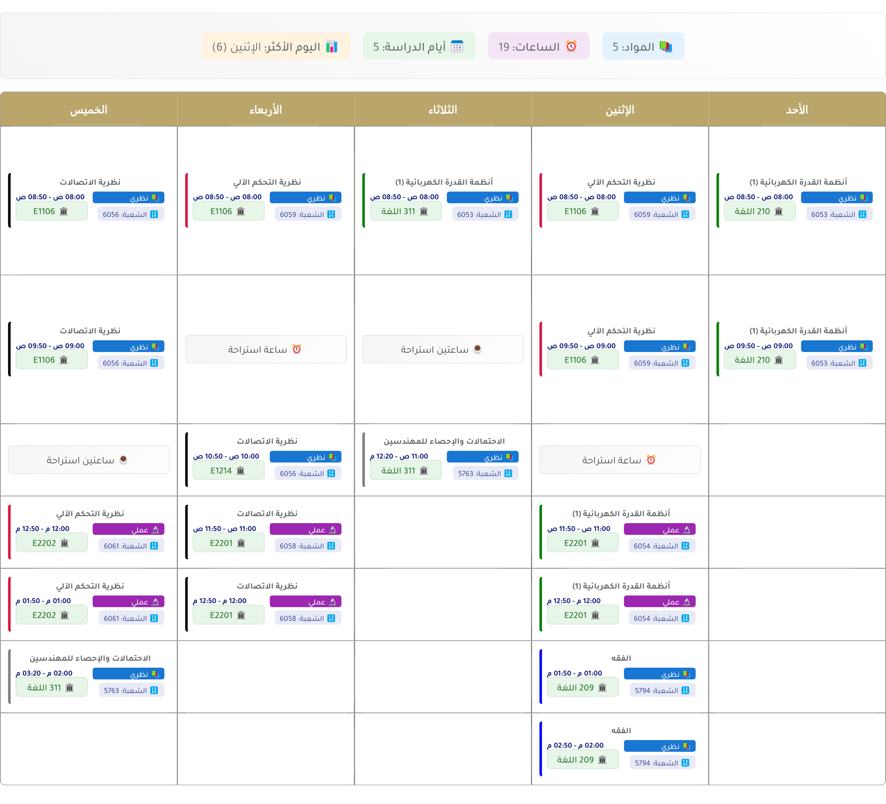

# IU Table Organizer

A Chrome extension/userscript to enhance and organize the Islamic University schedule table view. Transform your class schedule into a more readable format with one click.

## 📸 Before & After

  <h3>Before Organization</h3>
  
    
  <h3>After Organization</h3>
  

## ✨ Features

- 📅 Smart reorganization by weekdays
- 🎨 Intuitive color coding
- ⏰ Clear break display
- 📊 Schedule summary (credits, subjects, busy days)
- 📸 Export as PNG
- 🌐 Arabic interface support

## 🔧 Installation

### Method 1: Tampermonkey (Recommended)

1. First install the Tampermonkey extension
2. Then install the script

  <table style="border-collapse: separate; border-spacing: 30px; margin: 20px auto; background: none; border: none;">
    <tr>
      <td align="center" style="background: #ffffff; border-radius: 12px; padding: 25px; box-shadow: 0 4px 6px rgba(0, 0, 0, 0.1); min-width: 250px; transition: transform 0.2s;">
        <h4 style="margin: 0 0 15px 0; color: #2c3e50; font-size: 1.2em;">Step 1️⃣: Install Tampermonkey First</h4>
        <a href="https://www.tampermonkey.net/" style="text-decoration: none; color: inherit;">
          
           
          Install Tampermonkey
        </a>
      </td>
      <td style="font-size: 24px; padding: 0 10px; color: #666;">➔</td>
      <td align="center" style="background: #ffffff; border-radius: 12px; padding: 25px; box-shadow: 0 4px 6px rgba(0, 0, 0, 0.1); min-width: 250px; transition: transform 0.2s;">
        <h4 style="margin: 0 0 15px 0; color: #2c3e50; font-size: 1.2em;">Step 2️⃣: Install Script</h4>
        <a href="https://greasyfork.org/en/scripts/432219-%D9%85%D9%86%D8%B8%D9%85-%D8%AC%D8%AF%D9%88%D9%84-%D8%A7%D9%84%D8%AC%D8%A7%D9%85%D8%B9%D8%A9-%D8%A7%D9%84%D8%A7%D8%B3%D9%84%D8%A7%D9%85%D9%8A%D8%A9" style="text-decoration: none; color: inherit;">
          
           
          Install Script
        </a>
      </td>
    </tr>
  </table>

> 💡 Also works on mobile/tablet devices using Microsoft Edge 

### Method 2: Chrome Extension

1. Download and extract using the button below:
   

     
   

2. Go to `chrome://extensions/`
3. Enable "Developer mode"
4. Click "Load unpacked" and select the extracted folder

  

## 📝 Usage
1. Go to your IU schedule page
2. Click "نظم الجدول" to organize
3. Use "تحميل كصورة" to save as PNG

## 📜 Credits
- Original script by [ mah-sam](https://github.com/mah-sam)
- Using [html2canvas](https://html2canvas.hertzen.com/)

## 📄 License
MIT License - feel free to use, modify, and distribute as you wish! 