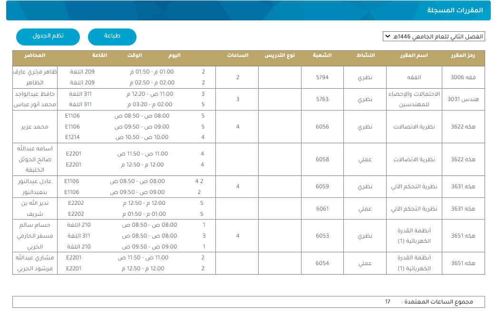

# IU Table Organizer

A Chrome extension/userscript to enhance and organize the Islamic University schedule table view. Transform your class schedule into a more readable format with one click.

## 📸 Before & After

  <h3>Before Organization</h3>
  
    
  <h3>After Organization (Light & Dark)</h3>
  

    

      
Light Mode

      
    

    

      
Dark Mode

      
    

  

## ✨ Features

- 📅 Smart reorganization by weekdays
- 🎨 Intuitive color coding
- ⏰ Clear break display
- 📊 Schedule summary (credits, subjects, busy days)
- 📸 Export as PNG
- 🌐 Arabic interface support

## 🔧 Installation

### Method 1: Tampermonkey (Recommended)

1. First install the Tampermonkey extension
2. Then install the script

| Step 1️⃣: Install Tampermonkey First | Step 2️⃣: Install Script |
|:---:|:---:|
|  |  |
| [Install Tampermonkey](https://www.tampermonkey.net/) | [Install Script](https://greasyfork.org/en/scripts/432219-%D9%85%D9%86%D8%B8%D9%85-%D8%AC%D8%AF%D9%88%D9%84-%D8%A7%D9%84%D8%AC%D8%A7%D9%85%D8%B9%D8%A9-%D8%A7%D9%84%D8%A7%D8%B3%D9%84%D8%A7%D9%85%D9%8A%D8%A9) |

💡 Also works on mobile/tablet devices using Microsoft Edge 🌐

### Method 2: Chrome Extension

1. Download and extract using the button below:
   

     
   

2. Go to `chrome://extensions/`
3. Enable "Developer mode"
4. Click "Load unpacked" and select the extracted folder

  

## 📝 Usage
1. Go to your IU schedule page
2. Click "نظم الجدول" to organize
3. Use "تحميل كصورة" to save as PNG

## 📜 Credits
- Original script by [mah-sam ](https://github.com/mah-sam)
- Using [html2canvas](https://html2canvas.hertzen.com/)

## 📄 License 
Mozilla Public License 2.0 - This Source Code Form is subject to the terms of the Mozilla Public License, v. 2.0. 
