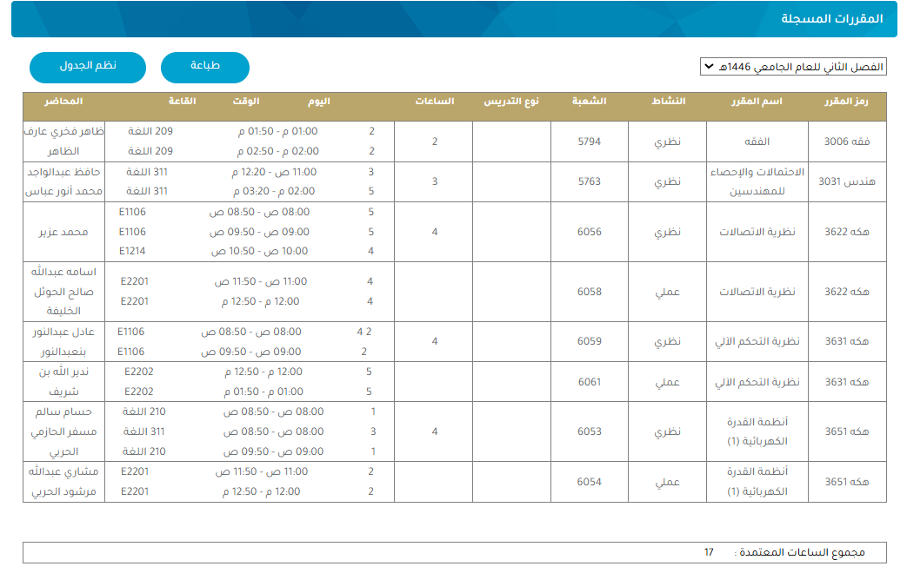
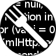

# IUM Table Organizer

📌 **Official Website:** [IUM Table Organizer](https://jawadk.me/IU_Table_Organizer/)

A Chrome extension/userscript to enhance and organize the Islamic University schedule table view. Transform your class schedule into a more readable format with one click.

## 📸 Before & After

### Before Organization

### After Organization (Light & Dark)

| Light Mode | Dark Mode |
|:----------:|:---------:|
|  |  |

## ✨ Features

- 📅 Smart reorganization by weekdays
- 🎨 Intuitive color coding
- ⏰ Clear break display
- 📊 Schedule summary (credits, subjects, busy days)
- 📸 Export as PNG
- 🌐 Arabic interface support
- 🌙 Ramadan time support

## 🔧 Installation

### Method 1: Chrome Web Store (Recommended)

### Method 2: Tampermonkey

| Step | Action |
|:----:|:------:|
| Step 1: [Install Tampermonkey](https://www.tampermonkey.net/) |  |
| Step 2: [Install Script](https://greasyfork.org/en/scripts/432219-iu-table-organizer) |  |

## 📝 Usage

1. Go to your IU schedule page
2. Click "نظم الجدول" to organize
3. Use "تحميل كصورة" to save as PNG

## 📜 Credits

- Original script by [mah-sam ](https://github.com/mah-sam)
- Using [html2canvas](https://html2canvas.hertzen.com/)

## 📄 License

Mozilla Public License 2.0 - This Source Code Form is subject to the terms of the Mozilla Public License, v. 2.0.

